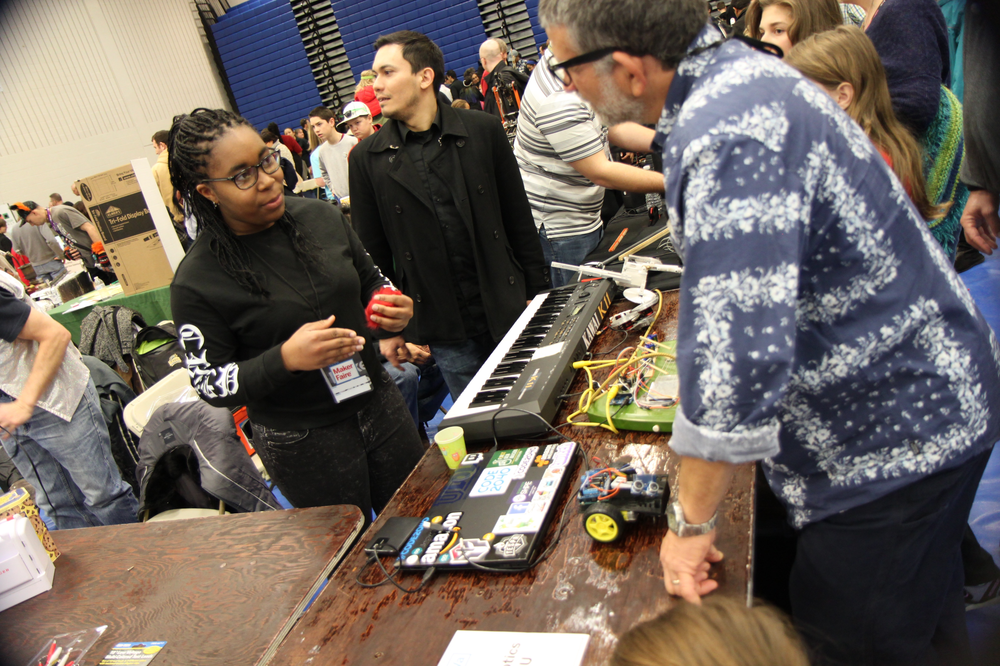

# *About Myself*

- I am a Junior at George Mason University, studying Psychology with a concentration in Human Factors and Applied Cognition with a double minor in Neuroscience and Bioengineering.
- I have an avid interest in Humanoid robotics, Cybernetics, and Human Computer Interfaces/Interaction.
- I plan on using this site to publish material and images/posts and descriptions of the different projects that I've done/been involved with and am currently doing. 

## *Major Projects*

  - RAT-BOT
  
  - MAKI
  
  - FlapJack
   
  - Cozmo
  
# *Things I've Tinkered With*

   - Autonomous Spoon Feeder for Patients with Tremours
   
   - Design of Multistage Electron Microscope Adapter
   
   - Area Image Processing of Aneurysm Prevention Device

   - Voice Controlled Non-Hollonomic Bot
  
   - Radioshack Decsion Maker
  
   - Google Voice
  
## Publications
### Header 3

**Bold** and _Italic_ and `Code` text

[Link](url) and 

